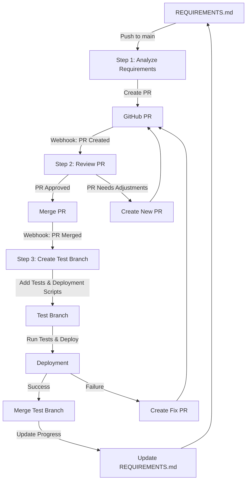

# Codegen CI/CD Workflow Diagram

## Workflow Steps

1. **Analyze Requirements**
   - Triggered by: Push to main branch with changes to REQUIREMENTS.md
   - Action: Analyze requirements and create a PR implementing them
   - Output: GitHub PR

2. **Review PR**
   - Triggered by: PR created or updated
   - Action: Review PR against requirements
   - Output: PR approved and merged, or new PR with adjustments

3. **Create Test Branch**
   - Triggered by: PR merged
   - Action: Create test branch with full test coverage and deployment scripts
   - Output: Test branch with tests and deployment scripts

4. **Deployment**
   - Triggered by: Test branch created
   - Action: Run tests and deploy
   - Output: Successful deployment or fix PR

5. **Update Progress**
   - Triggered by: Successful deployment
   - Action: Update REQUIREMENTS.md with progress
   - Output: Updated REQUIREMENTS.md with checkboxes

## Event Flow

| Event | Trigger | Action |
|-------|---------|--------|
| Push to main | Changes to REQUIREMENTS.md | Analyze requirements and create PR |
| PR created/updated | Webhook: pull_request | Review PR against requirements |
| PR merged | Webhook: pull_request.closed | Create test branch with tests and deployment scripts |
| Check suite completed | Webhook: check_suite | Fix failed checks |
| Deployment completed | Webhook: deployment | Update REQUIREMENTS.md with progress |

